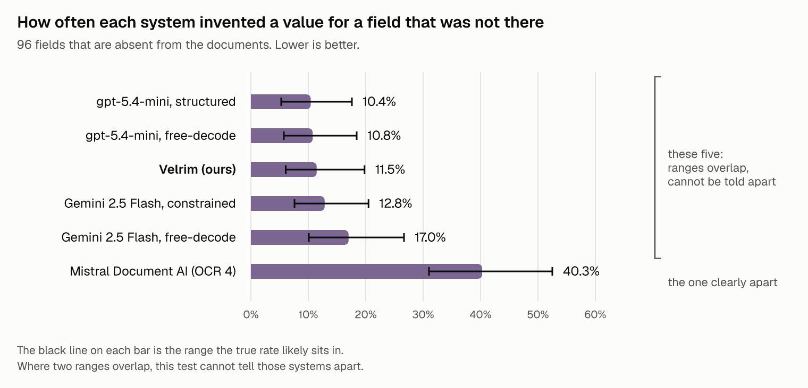
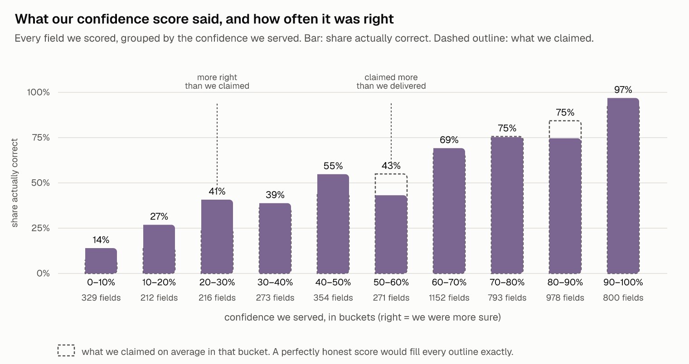
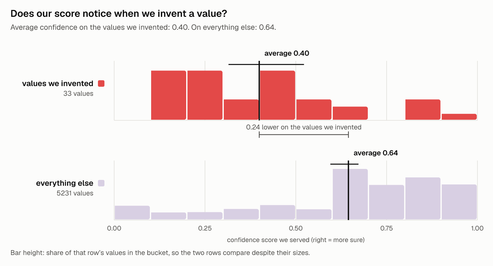

# Extraction APIs invented values for 17% of the fields that aren't in the document. Ours included.

Velrim ran this comparison, and we sell one of the six APIs in the table. Every raw output, request ID, and the scoring CLI are in the repo (https://github.com/velrimhq/velrim-eval).

## Why we ran this

It's not news to most of you that AI hallucinates. As of 2026-09-02 we couldn't find any public benchmark that measures the fabrication rate on the fields that aren't in the document (if one exists, tell us and we'll link it). Every extraction benchmark we found evaluates accuracy, while the number for AI making things up stays unpublished. We set out to change that.

The second purpose this whole run serves is directly related to the product we are selling. Velrim is 7-10x more expensive than the raw LLM models and I, as a founder, have been having a hard time justifying the gap. I'd spent months building V1, and while the intermediate numbers produced by the pipeline looked promising, without a proper benchmark I had no means of knowing how we compare. Before running it, we published the frozen plan (ANALYSIS-PLAN.md in the repo) with the execution policy and general rulings. So here it goes.

## The finding

We sent 124 real documents through six setups, asking them to extract the fields that aren't in those docs. The answer keys hold 96 such fields. The right answer for those is "null" e.g. "the field doesn't exist."

Every system invented answers for some of them: ours invented ~11%, the others were about the same, with differences being within noise. The only exception is Mistral, which invented ~40% of the missing fields. Pooled across all six systems, 17% of the absent fields came back with an invented value. The chart below shows the spread; the exact numbers are in the table further down.



The brackets on every number are uncertainty ranges: if two ranges overlap, this test can't tell those two systems apart.

Our worst accuracy is on the TV ad contracts, 0.59 out of 1. There's also one document type where the bare Gemini model beats us outright, you will see that in the next section.

## The tie we expected

Before running the benchmark, we published the plan in which we already expected the tie in accuracy. Velrim uses the very same LLM models underneath, so accuracy-wise it's indistinguishable from them. This was confirmed in practice, where we scored 2 points behind the bare Gemini. The difference is smaller than this test can detect, so it's a statistical tie.

> "The expected accuracy outcome between Velrim and the bare model it runs on ... is a statistical tie, and that tie is signed as publishable here, before any money is spent. A design that needs Velrim to win the F1 column is a failed design; this one does not." (ANALYSIS-PLAN.md §10, committed before the first paid call)

Two places we lose, and they go here rather than in a footnote. A DIY setup on OpenAI's small model beat us by about 4 points. On the US registration filings the bare Gemini beat us clearly.

_same base model — deliberate ablation (A1–A3): the full pipeline vs its underlying model and decoding_

| Arm                                                  | macro-F1 (norm) | strict | cord-v2 | deepform | vrdu-ad-buy | vrdu-registration |
| ---------------------------------------------------- | --------------- | ------ | ------- | -------- | ----------- | ----------------- |
| A1 Velrim (production, fitted stack `cal-2026.08-4`) | 0.691           | 0.669  | 0.791   | 0.786    | 0.588       | 0.598             |
| A2 Gemini 2.5 Flash, free-decode                     | 0.709           | 0.678  | 0.820   | 0.743    | 0.605       | 0.669             |
| A3 Gemini 2.5 Flash, constrained                     | 0.697           | 0.659  | 0.802   | 0.690    | 0.607       | 0.690             |
| A4 Mistral Document AI (OCR 4)                       | 0.712           | 0.608  | 0.746   | 0.802    | 0.605       | 0.694             |
| A5 gpt-5.4-mini, free-decode (DIY baseline)          | 0.735           | 0.707  | 0.832   | 0.826    | 0.628       | 0.654             |
| A5 gpt-5.4-mini, structured (DIY baseline)           | 0.718           | 0.696  | 0.798   | 0.813    | 0.626       | 0.634             |

At these document counts, gaps smaller than about 4–10 points per document type are practically invisible.

_"Constrained" and "structured" rows force the model’s output to match the schema as it writes; "free-decode" rows let it write freely and check the result afterward. On this corpus the difference is under 2 points for OpenAI’s model and noise for Gemini._

| Arm                     | macro-F1 (norm) | fabrication (absent fields) | wrong among the top 90% by confidence | \$/1k pages                      |
| ----------------------- | --------------- | --------------------------- | ------------------------------------- | -------------------------------- |
| Velrim                  | 0.691           | 11.5% [6.1, 19.8]           | 36.1% [29.9, 44.1]                    | \$20 (list; measured matches)    |
| Gemini free-decode      | 0.709           | 17.0% [10.1, 26.7]          | not requested                         | ~\$2.2 (measured, token-priced)  |
| Gemini constrained      | 0.697           | 12.8% [7.6, 20.5]           | not requested                         | ~\$2.2 (measured, token-priced)  |
| gpt-5.4-mini free       | 0.735           | 10.8% [5.7, 18.4]           | none surfaced                         | ~\$1.0 (measured, prompt-cached) |
| gpt-5.4-mini structured | 0.718           | 10.4% [5.3, 17.6]           | none surfaced                         | ~\$1.0 (measured, prompt-cached) |
| Mistral OCR 4           | 0.712           | 40.3% [31.0, 52.5]          | none surfaced                         | \$5 (list; measured \$5.3)       |

We're the most expensive row in this table. It doesn't buy you accuracy, as the table above shows. It buys the pipeline which provides the fabrication measurement, a published error rate, the exact spot in the document a value came from, and the CLI this whole comparison ran on. If a wrong extracted field costs you nothing, the bare model is a much better purchase.

## Fabrication

A field the document doesn't contain, answered with any value, counts as one fabrication. Answering null, leaving the key out, or returning an empty string or an "n/a" counts as declining to answer, which is not punished as invention. The judge is a mechanical comparison between the answer key and the output, no model and no confidence score involved.

| Arm                     | fabrication (pooled, n=96) | all-attempted rule | answered when field present | completed/attempted |
| ----------------------- | -------------------------- | ------------------ | --------------------------- | ------------------- |
| Velrim                  | 11.5% [6.1, 19.8]          | 11.5% [6.1, 19.8]  | 88.0% [84.0, 91.2]          | 372/372             |
| Gemini free-decode      | 17.0% [10.1, 26.7]         | 15.6% [9.3, 24.4]  | 96.5% [95.0, 97.7]          | 328/372             |
| Gemini constrained      | 12.8% [7.6, 20.5]          | 11.1% [6.6, 18.1]  | 96.7% [95.4, 97.9]          | 315/372             |
| gpt-5.4-mini free       | 10.8% [5.7, 18.4]          | 10.8%              | 96.1% [94.6, 97.3]          | 372/372             |
| gpt-5.4-mini structured | 10.4% [5.3, 17.6]          | 10.4%              | 95.6% [93.0, 96.9]          | 372/372             |
| Mistral OCR 4           | 40.3% [31.0, 52.5]         | 40.3%              | 96.6% [95.2, 97.9]          | 372/372             |

There's a very cheap way to win the fabrication column: refuse to answer anything you're not sure about. That's why the table also shows the other side of the coin. When the value actually is in the document, we leave about 12% of fields blank, while everyone else leaves about 4%, and this blank is a real cost you pay for our caution.

Before any competitor system ran, we hand-checked all 142 "this field is absent" labels against the actual pages. The labels come from third parties, and 40 of them were simply wrong: the supposedly missing value is printed right there in the document. Another 6 we couldn't settle either way, so all 46 came out of the count for everyone identically, with the per-label record in the repo. Show us another bad label if you ever spot one, and we will reclassify it accordingly.

Here's a quick summary per document type. On receipts we invent ~2% of absent fields, our best number in the table. Legacy registration filings is where everybody gets worse: we invent ~20% and bare Gemini ~33%, while Mistral invents ~75% of the absent fields there. The other two document types barely have naturally absent fields at all, so for those we measure with planted trap fields instead (the probe table below).

The traps: fields that can't exist in that document type, so any answer to those is an obvious invention. We fell for about 21% of them and OpenAI's model about 40%. Mistral is at 54%.

| Arm                     | probe fabrication  | n   |
| ----------------------- | ------------------ | --- |
| Velrim                  | 20.7% [15.3, 27.2] | 198 |
| Gemini free-decode      | 18.0% [13.1, 23.5] | 183 |
| Gemini constrained      | 20.0% [14.6, 26.4] | 165 |
| gpt-5.4-mini free       | 37.9% [30.1, 46.3] | 198 |
| gpt-5.4-mini structured | 39.9% [32.5, 48.4] | 198 |
| Mistral OCR 4           | 53.5% [45.5, 61.5] | 198 |

## Confidence

Only one vendor in this table hands you a per-field confidence number, and it's us. None of the other systems in this comparison will tell you how much to trust any individual field. The main products we know of that do surface a per-field score are the two whose terms prohibit benchmarking them. More about that below, under "What we could not run".

Our score makes claims like "I'm 80% sure about this field," and there's a simple way to test such a claim: take every field where we said 80, and count how many were actually right. When our score names a confidence number, the truth sits, on average, about 13 points away from it on a 0-to-100 scale. That includes the fields we refused to answer, which we count as if we'd claimed a coin flip. Drop those and the miss is about 10. For scale, even a perfectly honest score would look about 8 points off on a test this small, and the italic line under the chart has the exact figures.



_"an arm whose confidence scores were perfectly reliable would still measure mean plug-in ECE 0.084 [0.058–0.114] at n=196 — per-class ECE differences of that order sit at or below the estimator’s noise floor for 3 of 4 classes."_

Say you extracted 100 fields and want them in your database. For each field you have exactly two moves: use it as is, or have a human look at it. Without a confidence score, that choice is all-or-nothing. Trust the whole batch and about 40 fields go in wrong, and you don't know which ones. Check the whole batch and you've paid for extraction plus a full manual pass anyway.

The score sorts those 100 fields from most sure to least. The choice stops being all-or-nothing: you draw a line somewhere in the list, use everything above it as is, and send everything below it to a human. Draw it 70 fields deep and about 20 of those 70 are still wrong. That's ugly, but it's 20 in a known place instead of 40 scattered anywhere. Each row of the table below is one place to draw the line. How far down the list you can go depends on how clean you need your unchecked pile to be. The other systems return no score, so there's nothing to sort by and nowhere to draw a line, either trust-everything or check-everything.

| fields used without checking (most-confident first) | wrong among those  |
| --------------------------------------------------- | ------------------ |
| top 70%                                             | 28.8% [21.4, 37.7] |
| top 80%                                             | 33.6% [27.2, 42.6] |
| top 90%                                             | 36.1% [29.9, 44.1] |
| all 100%                                            | 40.2% [33.8, 48.1] |

One question was pre-registered before anything ran: when we invent a value, does our own confidence score notice? On the values we ourselves fabricated, the score averages 0.40, against 0.64 across everything it graded. Our inventions sink toward the bottom of the ranking. It does not identify them: some invented values still scored high, some honest ones scored low, and the figure shows both.



## What we could not run

Two of the best-funded extraction vendors have terms that prohibit benchmarking their products. Both publish named benchmarks of their competitors.

- Reducto, Terms of Use (effective 2026-04-17), Prohibited Uses: "Access or use the Services for any competitive purpose."
- LlamaIndex (LlamaExtract), Terms of Service (last modified 2024-06-07), §2.2(h): "use or display the Service in competition with us, to develop competing products or services, for benchmarking or competitive analysis of the Service, or otherwise to our detriment or disadvantage."

On 12 July we wrote to both, asking for written consent and offering the full frozen setup on acceptance, pre-publication access to replicate the run, and a right of reply. The window closed 20 July with no reply from either, so both were excluded and neither received a single live call. Consent is still open, which would put them into round 2 under the same protocol.

## Why you'd distrust this, and what we built for it

A benchmark from a company that sells one of the systems being scored deserves suspicion. We'd read ours that way too.

First of all, every rule here is older than every number: the metrics, the thresholds, even the headline variants were committed publicly before the first paid call. Second, you don't have to trust our scoring: the raw outputs, the request IDs, and the scorer itself are published, and re-running the entire scoring takes no API keys and costs nothing. Third, the results play against us in this very article: the DIY OpenAI setup beats us on accuracy, there's a document type where bare Gemini beats us, and the most expensive column in the price table is ours.

The documents: four hand-labeled, licensed, third-party sets that existed before Velrim did. Receipts (cord-v2), FCC political-ad invoices (deepform), FCC TV ad contracts (vrdu-ad-buy) and US DOJ FARA registration forms (vrdu-registration). 124 documents, 2,102 labeled fields, 319 pages. The scoring rules were amended twice before any number existed, both amendments version-bumped in public. A failed call scores as an empty answer and stays in every denominator. The brackets on every number come from resampling the documents 10,000 times, the exact statistical conventions are in ANALYSIS-PLAN.md.

The two Gemini setups failed on about 14% of their attempts. That was our fault. We hammered a brand-new Google project on its default quota, and almost every failure was a rate-limit rejection; the rest was one document that twice came back without usable JSON. Google's status page was clean for the whole window. Read the completed/attempted column as run completion, not vendor availability.

We also measured stability: run the same document three times and count how often the answers come back different. Ours come back different the most. About 36% of our repeats change, while the others sit roughly between 12% and 24%. Nearly all of it is one document type, the TV ad contracts with nested line-item tables, where a whole table of rows sometimes drops out between repeats. On simple fields we sit in the same range as everyone else.

The run itself wasn't clean. The runner was started three times, because we had to fix two transport misconfigurations mid-run. The manifests from the first and third starts publish with the results. The second one was overwritten before we archived it. One of our own cells was paid twice (\$0.90 at list, a checkpoint reset), and you can see it in the published request IDs.

What it cost: our own arm \$26.42, billed to ourselves at public list price through the production wallet. Mistral came to \$6.81, OpenAI \$2.53, Gemini €2.81. All-in that's about \$39, under the \$50–90 reproduction estimate we'd published. There is no latency column, because polling-based and synchronous APIs don't compare cleanly.

## Reproduce it

```
git clone https://github.com/velrimhq/velrim-eval
cd velrim-eval && npm install && npm test

# re-score any published arm from its raw outputs (no keys, $0); every cell of the tables re-derives this way:
npx velrim-eval score --predictions results/matrix-out/mistral/cord-v2/main/predictions.repeat-001.jsonl \
  --golden corpora/golden.cord-v2.jsonl --normalizers corpora/normalizers.cord-v2.json --out rescored/mistral-cord-v2

# fit the open confidence refit on our published scores (or on your own scores.json):
npx velrim-eval calibrate --scores results/matrix-out/velrim/cord-v2/main/score.repeat-001/scores.json

# re-run an arm live (your keys, your spend): see README, "Adapters and live runs".
# Every live command prints the expected cost first and refuses without --confirm-spend.
```

Scoring the published outputs is free and needs no keys. Anything that spends money prints the expected cost first and refuses to run without an explicit --confirm-spend. And --golden points the whole harness at your own labeled documents instead of ours.

## Every disclosure

Our confidence score was fit on one half of these same four document sets and scored only on the other half. Which half was which was locked in June, before this comparison was designed, so we couldn't have tuned on the test half. The salt that lets anyone check that is SALT.md in the repo. Our pipeline was developed against these document types' dev split, which is why round 2 adds a document class Velrim code has never seen. The full register, 17 items with what we did about each, is DISCLOSURES.md in the repo.

## Licenses and attribution

CORD-v2: CC BY 4.0, NAVER CLOVA (Park et al., 2019). VRDU ad-buy and registration: CC BY 4.0, Google Research (Wang et al., KDD 2023, arXiv:2211.15421), documents from FCC Public Inspection Files and US DOJ FARA public filings. DeepForm: MIT (© 2020 Project DeepForm), 2020 slice only, FCC OPIF. Full notices in the repo. All trademarks are the property of their respective owners; no affiliation or endorsement is implied.

## Re-runs and round 2

If a vendor thinks we're calling their API wrong, they can open a PR against the adapter: we'll re-run it and re-publish, with a changelog entry. Numbers a vendor produces themselves only enter the table under the frozen config, verified by our own re-run, and labeled as theirs. And when a competitor ships a major version, we'll re-run on request.

Round 2 was announced before round 1 ran, with the following planned:

- the consent-gated vendors, if consent arrives;
- a document class no Velrim code has ever touched;
- the same open confidence refit for every arm;
- a confidence column for OpenAI's model built from its token probabilities;
- a latency appendix;
- five repeats instead of three.

I ran this to find out whether I am a Gemini reseller. The accuracy column says yes. The confidence column says not quite. That being said, the only ones who get to judge that are actual customers. We'll keep running this until the confidence column is the reason you buy, and we'll publish every run on our way there, including the ones we lose.

## Changelog

- 2026-09-02: the reproduce commands call `npx velrim-eval`, and `npm install` now builds the CLI.
